#  * Property Price Prediction - Report 
## DATA606 - Capstone Project 
## 1. Title and Author
- **Title** - Property Price Prediction
- **Author Name** - Balaji Manoj Jollu
- Prepared for UMBC Data Science Master Degree Capstone by Dr Chaojie (Jay) Wang
- Link to Author GitHub Account - [GitHub](https://github.com/Jollu-Balaji-Manoj)
- Link to Author LinkedIn Account - [LinkedIn](www.linkedin.com/in/balaji-manoj-jollu)
- Link to your Project PowerPoint presentation file - [Property price predictions](https://docs.google.com/presentation/d/1ARX-va2LRkcK0m8N6QgC5Mdt06Lmu0eEOjgbuWnB6FM/edit#slide=id.p1)
- Link to your YouTube video - [Project Demo](www.linkedin.com/in/balaji-manoj-jollu)

## 2. Background
###  What is it about? 
   * Property price prediction is a crucial subject within the realms of real estate and finance. It encompasses the task of forecasting the future values of real estate assets, which can include houses, apartments, commercial properties, and land, by leveraging data and various predictive modeling techniques.

###  Why does it matter?  

   * Property price predictions are important because they affect investment decisions, advise purchasers and sellers, influence real estate development, inform policy decisions, and serve as economic indicators. However, these predictions are loaded with risk and should be considered with other criteria for well-informed decision-making.

###  What are your research questions?
  
   * Essential variables: we seek what variables influence property values, such as location, size, amenities , property type .

   * Model Effectiveness: Evaluating the effectiveness of machine learning models for predicting prices, such as Linear Regression, Decision Trees and Random Forest, XGBoost, LightGBM, Support Vector Regression (SVR), and K-Nearest Neighbors (KNN) using our dataset and problem you are working with.

## 3. Data 

  1. This is open source data set from Kaggle - https://www.kaggle.com/code/goyaladi/property-price-ann-predictions/input
  2. Size of data Is 180 MB 
  3. data contains 332096 rows and 32 columns
  4. we can see data is extracted from website www.makaan.com from india  recently 
  5. Data Dictionary:
     
| Column Name            | Data Type | Description                                        |
|------------------------|-----------|----------------------------------------------------|
| Property_Name          | object    | Name of Property                                   |
| Property_id            | int64     | Property id from the website                       |
| Property_type          | object    | Type of property (Apartment, Residential Plot, Villa, Independent Floor, Independent House) |
| Property_status        | object    | Status of property (Ready to move, Under Construction) |
| Price_per_unit_area    | object    | Price of unit area                                 |
| Project_URL            | object    | Website of project                                 |
| builder_id             | float64   | Builder Information                                |
| Property_building_status | object  | Status of building (ACTIVE, INACTIVE, UNVERIFIED)  |
| City_name              | object    | Name of city property located                      |
| No_of_BHK              | object    | Number of bedrooms                                |
| Locality_ID            | int64     | Zipcode of location                                |
| Locality_Name          | object    | Area of property                                   |
| Longitude              | float64   | Longitude                                          |
| Latitude               | float64   | Latitude                                           |
| Price                  | object    | Price of property                                  |
| Size                   | object    | Size of property in sq feet                        |
| Sub_urban_ID           | int64     | Neighbourhood id                                   |
| Sub_urban_name         | object    | Neighbourhood name                                 |
| description            | object    | Property description                               |
| is_furnished           | object    | Furnished or not                                   |
| listing_domain_score   | float64   | Domain score                                       |
| is_plot                | bool      | Is it plot or not                                  |
| is_RERA_registered      | bool      | Is it approved by Real Estate Regulatory Authority (RERA) |
| is_Apartment           | bool      | Is it apartment or not                             |
| is_ready_to_move       | bool      | Is it available to move or not                     |
| is_commercial_Listing  | bool      | Is it commercially listed or not                   |
| is_PentaHouse          | bool      | Is it penthouse or not                             |
| is_studio              | bool      | Is it studio or not                                |
| Listing_Category       | object    | Under which category it is listed (sell, rent)     |

  6. Price  variable/column will be your target/label in your ML model.
  7. Rest of variables/columns  are Property_type, Property_status, Price_per_unit_area, builder_id, Builder_name, Property_building_status, City_id, City_name, No_of_BHK, Locality_ID, Locality_Name, Longitude, Latitude, Size, Sub_urban_ID, Sub_urban_name, is_furnished, listing_domain_score, is_plot, is_RERA_registered, is_Apartment, is_ready_to_move, is_PentaHouse, is_studio

## 4. Exploratory Data Analysis (EDA) 

   * Graph for Count of property type for each city
  
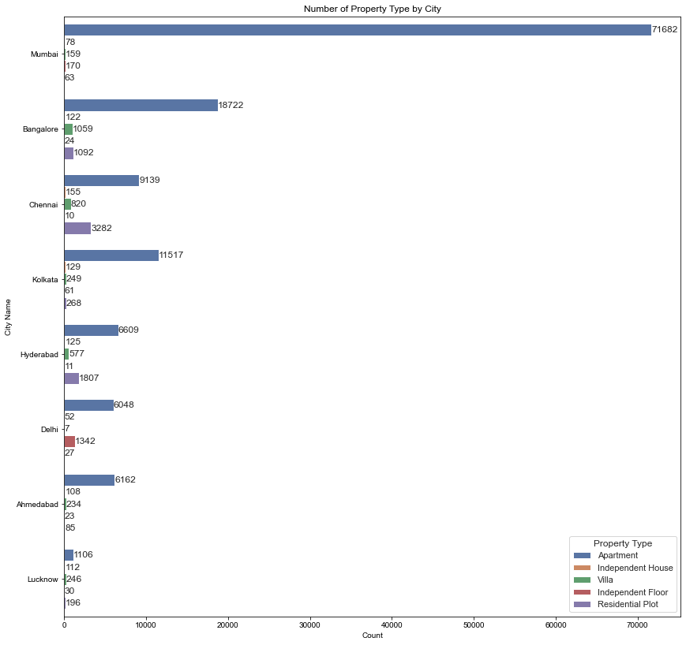

   * Graph for Average Price (USD) by Property Type and City
  

   *  Histogram of Price per Unit Area

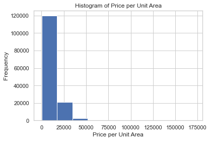

   * Histogram of Number of BHK

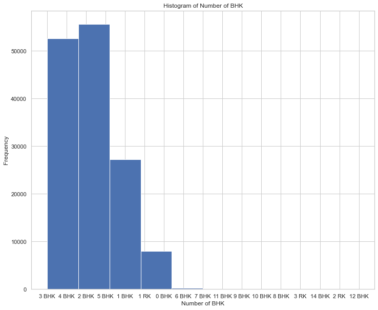

   * Top 10 Builders by Count¶

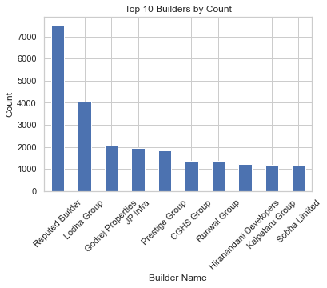

   * Graph for Average Price by Property_type

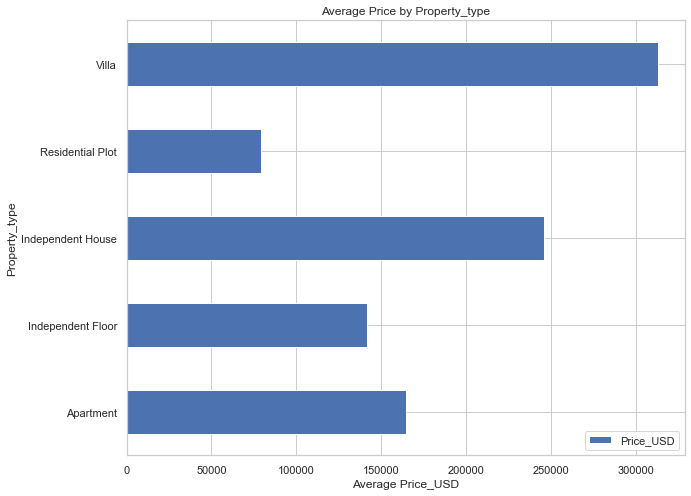

   * Graph for Average Price by Property_status

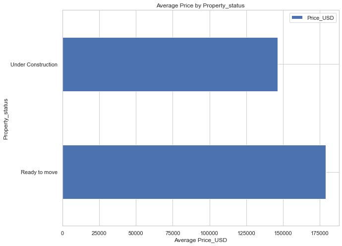

   * Graph for Average Price by City_name

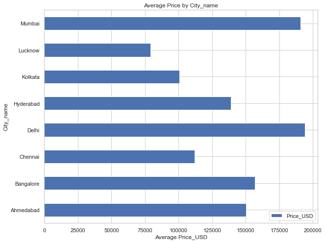

   * Graph for Average Price by No_of_BHK

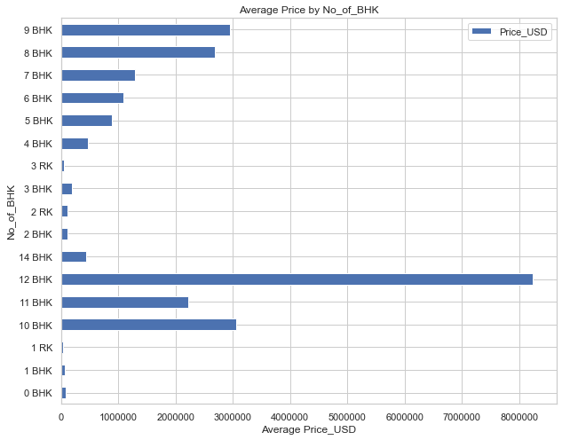

   * Correlation Heatmap

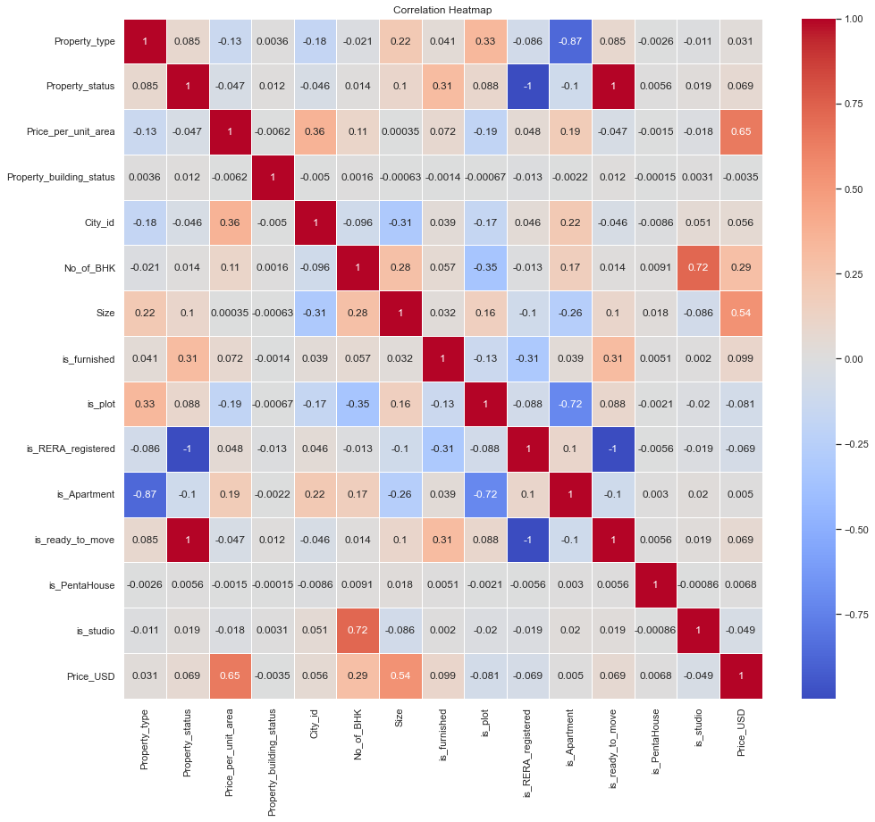

   * Graph of Correlation of columns with respective our Target Column(Price_USD)

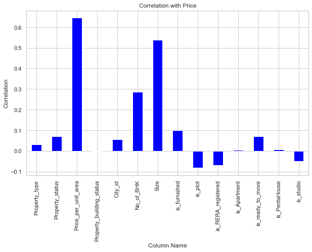

## 5. Model Training 

   * Models for Predictive Analytics: After careful consideration, we have chosen the following models for predictive analytics are 
1. Linear Regression
2. Decision Tree
3. Random Forest
4. XGBoost
5. Support Vector Regression (SVR)
6. k-nearest neighbors (KNN)

   * Model Training:

1. Train-Test Split: The selected models were trained using an 80/20 train-test split. This allocation ensures a robust training dataset while allowing for effective model evaluation.

2. Python Packages: The predictive models were implemented using popular Python libraries, including scikit-learn for machine learning algorithms and analysis.

3. Development Environments: The development was conducted on a local machine, leveraging the computational capabilities of our laptop. Additionally, we utilized Google Colab for collaborative and cloud-based development.

   * Code Implementation:

1. Python Code: The prediction model was implemented in Python, providing a flexible and efficient environment for data analysis and machine learning.

   * Model Performance Evaluation:

1, Evaluation Metrics: The performance of each model was assessed using key metrics, including Mean Absolute Error (MAE), Mean Squared Error (MSE), and R-squared (R2).

2. Graphical Representation: The graph below illustrates the performance comparison of the models. Notably, depicts the comparative performance of various models for property price prediction. Decision Tree and Random Forest models exhibit superior accuracy with low MAE and MSE, along with high R-squared values. XGBoost closely follows with competitive accuracy. Linear Regression and K-Nearest Neighbors show moderate performance, while Support Vector Regression (SVR) underperforms, suggesting limitations for this task. Ensemble models, especially Decision Tree and Random Forest, excel, making XGBoost a strong alternative. Caution is advised with SVR, and the graphical representation aids in a clear comparison of model performance metrics.

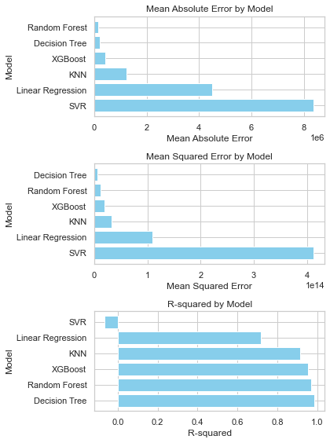

## 6. Application of the Trained Models

   * Web App Development:

Streamlit Framework: We have developed a user-friendly web application using the Streamlit framework. Streamlit enables seamless integration with our trained models, providing an intuitive interface for users to interact with and obtain property price predictions.

   * Application of the Trained Models:

1. Purpose:

The Streamlit web application utilizes our trained models to provide users with accurate property price predictions.

2. User Interaction:

Users input property features via the intuitive interface.Trained models process the inputs to generate precise price predictions.

3. Benefits:

3.1. Accessibility: The web app is easily accessible, offering users a convenient platform for property price estimates.
3.2. Interactivity: Users can dynamically adjust inputs for an interactive experience, gaining insights into the factors influencing property prices.

## 7. Conclusion
   * Conclusion:
In conclusion, our Property Price Prediction study underscores the critical importance of accurate projections for various real estate stakeholders. It highlights the challenges inherent in forecasting property values, emphasizing the necessity for robust data quality and preprocessing. Additionally, recognizing temporal patterns and incorporating risk factors are identified as crucial considerations. Ethical concerns have been addressed, and the study provides valuable insights that can inform real estate decision-making. The findings open avenues for further research and development in this domain.

   * Limitations:
However, it's essential to note that our prediction system is limited to preexisting cities within the dataset and specific property specifications.

   * Lessons Learned:
Throughout this project, we gained valuable experience in building machine learning models and understanding the complexities of predicting property prices.

   * Future Research Direction:
Looking ahead, there is potential for integration with popular real estate websites such as Apartment.com, Zillow, Airbnb, etc. This could extend the model's applicability beyond predefined data, allowing for a more comprehensive and versatile approach to property price prediction. Future research could focus on refining the model for broader usability and addressing new challenges that may arise in the dynamic real estate landscape.

## 8. References
 1. Ja’afar, N. S., Mohamad, J., & Ismail, S. (2021). Machine learning for property price prediction and price valuation: a systematic literature review. Planning Malaysia, 19.
 2. Mohd, T., Jamil, N. S., Johari, N., Abdullah, L., & Masrom, S. (2020). An overview of real estate modelling techniques for house price prediction. In Charting a Sustainable Future of ASEAN in Business and Social Sciences: Proceedings of the 3ʳᵈ International Conference on the Future of ASEAN (ICoFA) 2019—Volume 1 (pp. 321-338). Springer Singapore.
 3. Sarip, A. G., Hafez, M. B., & Daud, M. N. (2016). Application of fuzzy regression model for real estate price prediction. Malaysian Journal of Computer Science, 29(1), 15-27.
